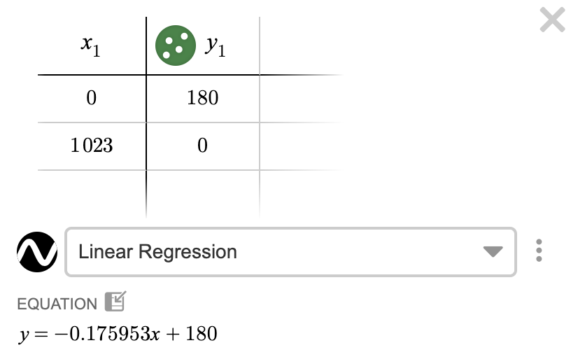
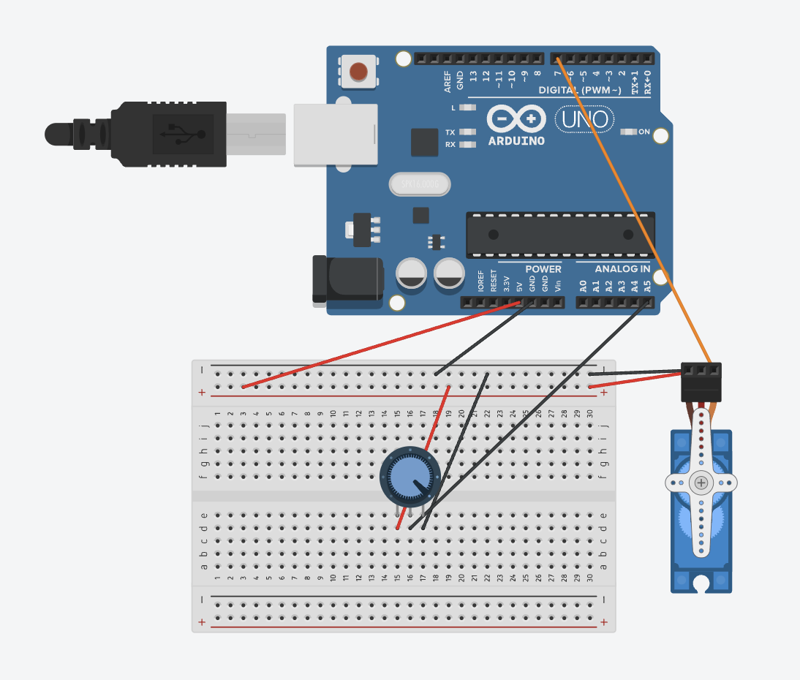

# Servo motor controlled using potentiometer

In this project, I learnt how to use a potentiometer to control a servo motor.

## Key Takeaways

- Controlling a servo motor
- The servo motor's angle of rotation is between 0 and 180 degrees
- Using the `map()` function removes needing to do the math 

## Images

